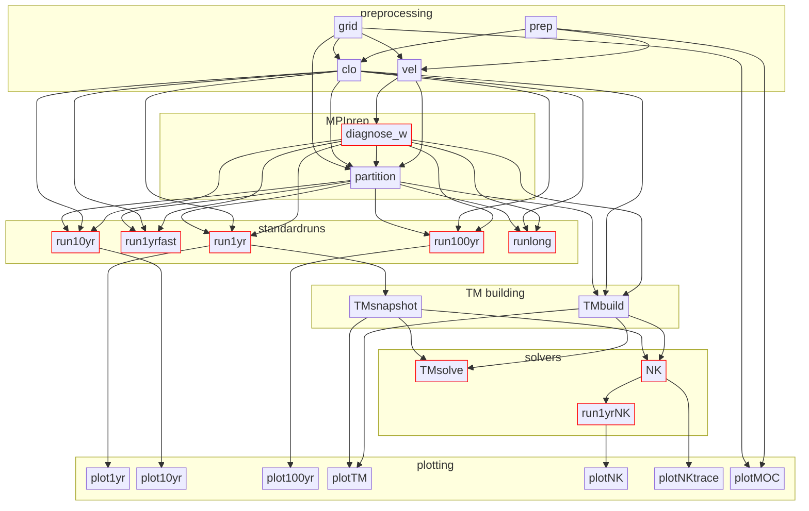

# {{ $frontmatter.title }}

{{ $frontmatter.description }}

## The problem

A modelling pipeline on Gadi with a couple of dozen steps: preprocessing, MPI partitioning, model runs of various lengths, building and solving transport matrices, and plotting. Each step is a PBS job, several need a GPU, and most depend on the outputs of earlier ones. Submitting these by hand, in the right order, with the right `-W depend=afterok:...` flags, is tedious and error-prone. Re-running only the part that changed is worse.

## Step 1: write the workflow down as a graph

I used Claude Code, running on Gadi over SSH, to help write the pipeline as a directed acyclic graph (DAG). The source of truth is a single Mermaid file, `pipeline.mmd`, which renders as the diagram below. Steps outlined in red run on GPU nodes.



Having the graph in a text file does two jobs at once. It is documentation that a human can read in the repo (GitHub renders Mermaid in markdown), and it is a precise specification the assistant can work from when writing code.

## Step 2: have Claude write the driver

With the DAG in place, I asked Claude Code to write `scripts/driver.sh`: a script that submits the PBS jobs for a requested set of steps, wiring up the `afterok` dependencies from the graph. The interface it settled on is a single `JOB_CHAIN` environment variable.

- `JOB_CHAIN` is required. With it unset, the driver prints usage help and exits.
- Steps listed in the chain are submitted, in dependency order. Steps not in the chain are skipped, and their outputs are assumed to already exist.
- `PARENT_MODEL` is also required. There is no default.

### Shortcuts

Some groups of steps come up often enough to deserve a name.

| Shortcut | Expands to |
|---|---|
| `preprocessing` | `prep-grid-vel` |
| `standardruns` | `run1yr-run10yr-run100yr-runlong` |
| `TMall` | `TMbuild-TMsnapshot-TMsolve` |
| `plotall` | `plot1yr-plot10yr-plot100yr-plotNK` |
| `full` | `preprocessing-run1yr-TMall-NK-run1yrNK-plotNK-plot1yr` |

### Range notation

`A..B` expands to every step on any path from A to B in the DAG. It is not a flat list of everything between them: steps off the path are left out.

### Examples

```bash
# Only run Newton-GMRES solves (matrices must already exist)
PARENT_MODEL=ACCESS-OM2-1 JOB_CHAIN=NK bash scripts/driver.sh

# Run 1-year simulation and plot
PARENT_MODEL=ACCESS-OM2-1 JOB_CHAIN=run1yr-plot1yr bash scripts/driver.sh

# Build matrices and run all solvers
PARENT_MODEL=ACCESS-OM2-1 JOB_CHAIN=run1yr-TMall-NK bash scripts/driver.sh

# Everything from vel to NK (range follows the DAG, excludes run10yr/runlong/TMsolve)
PARENT_MODEL=ACCESS-OM2-1 JOB_CHAIN=vel..NK bash scripts/driver.sh

# Re-run + plot from NK solution (range follows NK→run1yrNK→plotNK path only)
PARENT_MODEL=ACCESS-OM2-1 JOB_CHAIN=run1yrNK..plotNK bash scripts/driver.sh

# Run both const and avg branches
PARENT_MODEL=ACCESS-OM2-1 TM_SOURCE=both JOB_CHAIN=NK-run1yrNK-plotNK bash scripts/driver.sh

# Run preprocessing only
PARENT_MODEL=ACCESS-OM2-1 JOB_CHAIN=preprocessing bash scripts/driver.sh

# Specify experiment and time window
PARENT_MODEL=ACCESS-OM2-1 EXPERIMENT=1deg_jra55_ryf9091_gadi TIME_WINDOW=1958-1987 JOB_CHAIN=full bash scripts/driver.sh

# ACCESS-OM2-025 with specific GPU queue
PARENT_MODEL=ACCESS-OM2-025 GPU_RESOURCES=gpuvolta JOB_CHAIN=run1yr bash scripts/driver.sh
```

## What made this work

- **A concrete artefact to point at.** The assistant was not asked to guess the workflow. The `.mmd` file spelled out every step and edge, so the driver could be checked against it.
- **The diagram stays useful after the code is written.** When the pipeline changes, the graph is edited first, and the driver follows.
- **Small conveniences are cheap to ask for.** Shortcuts and range notation took a sentence each to request, and they are what make the driver pleasant to use day to day.

See also the [HPC (Gadi)](/gadi) page for setting up VSCode and Claude Code over SSH.
