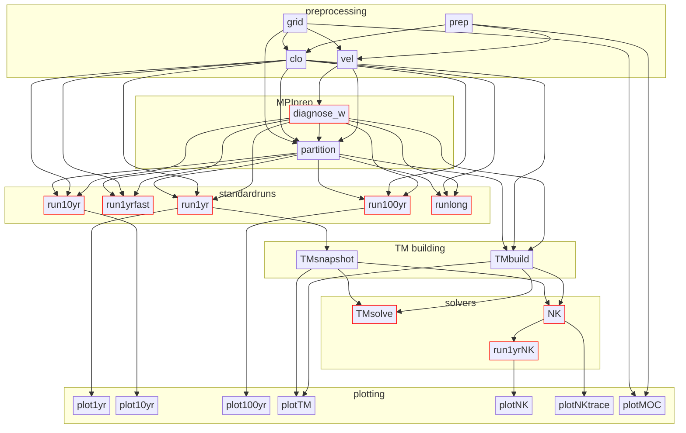

# {{ $frontmatter.title }}

{{ $frontmatter.description }}

<CategoryTags :categories="$frontmatter.categories" />

## A complicated modelling pipeline

That research project involves a complicated modelling pipeline on Gadi with a couple of dozen steps: preprocessing, MPI partitioning, simulation runs of various lengths, building and solving related by separate problems in parallel, and plotting once all the simulations are done and the outputs written.
In this pipeline, each step is a PBS job with specific resource requirements (CPUs, GPUs, wall time, memory, etc.), and most depend jobs on the outputs of earlier ones.
To submit these in the right order, there are two options:
- Manually check with `qstat` which jobs finished and submit the next one by hand -> time consuming
- use Gadi's PBS directives for dependencies like `-W depend=afterok:...`, but this requires typing all the previous jobs IDs
Both options above are tedious and error-prone.
Below is my solution.

## Step 1: Write the pipeline down as a graph

First I identified and gave a short name to each job.
For example, in the preliminary part of the pipeline, I named a preprocessing job `prep`, the grid-building job `grid`, the velocity-field building job `vel`, and the turbulence-closure-building job `clo`.
You don't need to know what these are, just that they are individual jobs that I submit as PBS scripts.

Then, I built a [Directed Acyclic Graph (DAG)](https://en.wikipedia.org/wiki/Directed_acyclic_graph).
A DAG is just the fancy word that describes what the pipeline actually is:
A bunch of nodes (the jobs/PBS scripts) and some arrows that connect them.
A tool I used to plot this graph directly in markdown files is [mermaid](https://mermaid.ai/open-source/syntax/flowchart.html)
You don't need to know much about it, except that if `vel` and `clo` depend on `prep` and `grid`, then you can "encode" it in the DAG as
```
prep & grid --> vel & clo
```
Simple, right?
I stored this as a single "Mermaid" file, called `pipeline.mmd`, which renders as the diagram below:



Having the graph in a text file does two jobs at once.
It is documentation that a human like me and you right now can read (e.g., in VSCode or online; GitHub renders Mermaid in markdown), and it is a precise specification for the LLM to write the code that will submit jobs according to this pipeline.

## Step 2: have Claude write the driver

With the DAG in place, I asked Claude Code to write a `driver.sh` script:
It submits the PBS jobs for a requested set of steps, using the right PBS directives (the `afterok` flags) from the graph.
The interface I settled on is to pass it a single `JOB_CHAIN` environment variable.
I then made it add some [syntactic sugar](https://en.wikipedia.org/wiki/Syntactic_sugar) for me.
That is, a bunch of shortcuts to make my life easier, which I describe below.

Some groups of jobs come up often enough to deserve a name (see examples in table below).

| Shortcut | Expands to |
|---|---|
| `preprocessing` | `prep-grid-vel` |
| `standardruns` | `run1yr-run10yr-run100yr-runlong` |
| `TMall` | `TMbuild-TMsnapshot-TMsolve` |
| `plotall` | `plot1yr-plot10yr-plot100yr-plotNK` |
| `full` | `preprocessing-run1yr-TMall-NK-run1yrNK-plotNK-plot1yr` |

Another thing I wanted was some sort of "range" notation, when I want to resubmit job `B` but I know an output I need from a previous job `A` is stale (maybe I changed some input for `A` so I need to re-run it).
So I made it accept `A..B`, which would expand to every step on any path from A to B in the DAG, making sure no link is missing in the pipeline.

### Examples

Below are some examples of the interace it built for me, and I can even ask the LLM to submit these commands directly for me using plain language.
Note

```bash
# Run 1-year simulation and plot
JOB_CHAIN=run1yr-plot1yr bash scripts/driver.sh

# Everything from vel to NK (range follows the DAG)
JOB_CHAIN=vel..NK bash scripts/driver.sh

# Re-run + plot from NK solution
JOB_CHAIN=run1yrNK..plotNK bash scripts/driver.sh

# Run preprocessing only
JOB_CHAIN=preprocessing bash scripts/driver.sh
```

My actual pipeline actually does a bit more now than that now, but you get the idea:
Writing a driver like that was out of my skill set and available time:
Using a LLM made it possible.

## Important: Why this worked

- **A precise spec.** The LLM cannot guess the pipeline. I built the DAG before by hand, and then pointed the LLM to it. The LLM did help me review that I did not miss any links though.
- **The diagram stays useful after the code is written.** When the pipeline changes, the graph is edited first, and the driver follows. I understand what it does, and the driver script can actually be submitted "dry" for the LLM to check that it would submit the right jobs with the right deps.
- **Small conveniences are cheap to ask for.** Shortcuts and range notation did not take too much work (bvack and forth with the LLM) but they make the driver "pleasant" to use day to day.
- **The driver's own documentation**, which the LLM wrote, and which contains examples such as those I showed above, also allows me to directly ask the LLM to submit these driver commands in plain english, so now I can prompt things like:
    ```
    I have updated the input data for the `vel` job.
    I need job `A` to use these new inputs.
    Can you resubmit `vel..A` through the driver?
    ```

